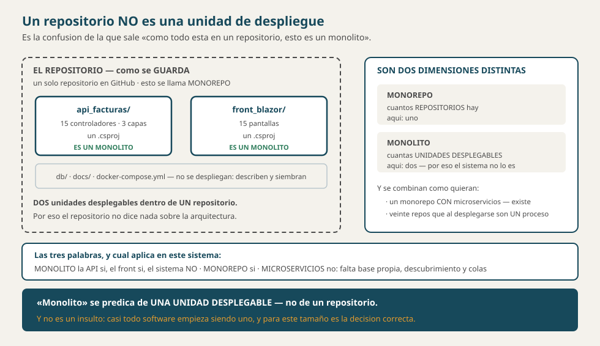
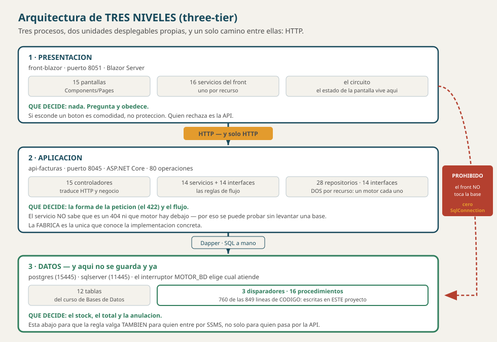
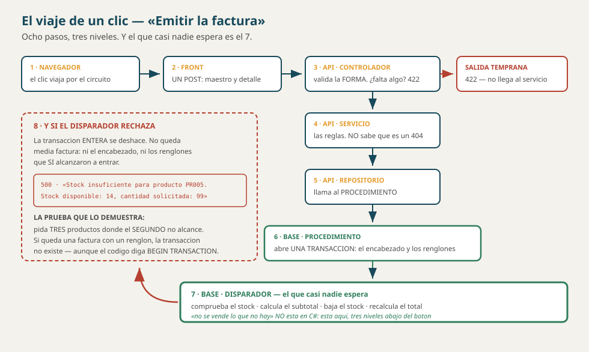

# La arquitectura del software — qué es este sistema

**Documento conceptual del curso**

> **Qué es este documento.** La vista de arriba: **cuántas piezas hay, qué hace
> cada una y cómo se hablan**. Es la puerta de entrada — lo de adentro de cada
> pieza está en otros documentos, y aquí se dice cuál.
>
> **Empiece por aquí** si lo que quiere saber es *«¿qué estoy viendo?»*.
>
> **Todas las cifras están medidas contra el código**, y §8 trae los comandos
> para volver a contarlas.

---

## 1. Lo primero, porque es lo que más se confunde

**Un repositorio no es una unidad de despliegue.**



| | Qué dice | Cómo se llama tener todo junto |
|---|---|---|
| **El repositorio** | cómo se **guarda** el código | **monorepo** |
| **La arquitectura** | cómo se **ejecuta** | eso es otra cosa |

> **Son dos dimensiones independientes.** Hay monorepos con microservicios, y
> hay sistemas de veinte repositorios que al desplegarse son un solo proceso. Lo
> uno no dice nada de lo otro.

---

## 2. Qué es este sistema: tres niveles



| Nivel | Proceso | Puerto | Qué decide |
|---|---|---|---|
| **Presentación** | `front-blazor` | 8051 | **nada**: pregunta y obedece |
| **Aplicación** | `api-facturas` | 8045 | la forma de la petición y el flujo |
| **Datos** | `postgres` · `sqlserver` | 15445 · 11445 | **el stock, el total, la anulación** |

**Arquitectura de tres niveles** *(three-tier)*. Es el nombre canónico, y es el
que hay que saber decir.

> **Pero con una diferencia respecto al three-tier de manual, y es la que define
> a este sistema:** en el libro, el nivel de datos **guarda y ya**. Aquí
> **defiende las reglas** — tiene 3 disparadores y 16 procedimientos, y de las
> **849 líneas de código** del script **760 se escribieron en este proyecto**.
>
> Por eso la pregunta *«¿dónde va esta validación?»* tiene **tres** respuestas
> posibles y no dos. Ver §6.

---

## 3. ¿Es un monolito?

> **La API es un monolito. El front también. El sistema no.**

Las tres son ciertas **a la vez**. «Monolito» se predica de **una unidad
desplegable** — no de un repositorio, no de un sistema entero.

| | Es **una** unidad desplegable | Por qué |
|---|---|---|
| `api-facturas` | **sí** | Cambiar una línea de un controlador obliga a desplegar **toda** la API |
| `front-blazor` | **sí** | Cambiar un color obliga a publicar **las 15 pantallas** |
| **El sistema** | **no** | Son **dos** monolitos: se compilan, se despliegan y **se caen** por separado |

> **Y monolito no es un insulto.** Casi todo software empieza siendo uno, y para
> este tamaño es **la decisión correcta**. Lo que importa no es si algo es
> monolito, sino **cuántas unidades desplegables hay y cómo se hablan**.
>
> Un monolito ordenado por dentro —en capas, con interfaces— se llama **monolito
> modular**, y es lo que son estos dos.

**Y no son microservicios**, aunque sean dos procesos. Faltan todas las señas:
no hay una base por servicio —hay **una** compartida—, no hay descubrimiento, no
hay colas, y no hay despliegue independiente de partes de la API.

> El detalle completo, con los comandos que lo prueban, está en
> [`ARQUITECTURA.md`](../dominio/ARQUITECTURA.md) §2.

---

## 4. El backend: la API

**Una unidad desplegable, tres capas por dentro.**

```
Controlador  →  Servicio  →  Repositorio  →  la base de datos
   (HTTP)       (reglas)       (SQL)
```

| Carpeta | Cuántos | Qué hay |
|---|---|---|
| `Controllers/` | **15** | uno por recurso. Traduce HTTP ↔ negocio |
| `Servicios/` | **28** | 14 implementaciones + sus 14 interfaces |
| `Repositorios/` | **43** | 28 repositorios —**dos por recurso**— + 14 interfaces + el traductor de errores |
| `Peticiones/` | **37** | una clase por verbo: lo que se acepta de afuera |
| `Fabricas/` | **3** | la que decide el motor |

> **Esos 28 contra 14 son la arquitectura en un número:** cada contrato tiene
> **dos** implementaciones —PostgreSQL y SQL Server— y **arriba nadie sabe cuál
> está puesta**, porque arriba se usa siempre la interfaz.

**Las tres prohibiciones**, que son la mitad de la arquitectura:

| Capa | Tiene PROHIBIDO |
|---|---|
| Controlador | escribir SQL · tomar decisiones de negocio |
| Servicio | **saber qué es un 404** · saber qué motor hay debajo |
| Repositorio | decidir códigos de estado |

> **Detalle:** [`ARQUITECTURA.md`](../dominio/ARQUITECTURA.md) ·
> **Los patrones:** [`SOLID_CAPAS_PATRONES.md`](SOLID_CAPAS_PATRONES.md)

---

## 5. El frontend

**Blazor Server**: el componente vive **en el servidor**, el navegador recibe
HTML y mantiene un **circuito** abierto.

| Carpeta | Cuántos | Qué hay |
|---|---|---|
| `Components/Pages/` | **15** | una pantalla por recurso, con dirección propia |
| `Components/Compartidos/` | **1** | lo que se repetía en todas: el `Aviso` |
| `Components/Layout/` | **3** | el marco y el menú |
| `Servicios/` | **16** | **uno por recurso**, más `EstadoSesion` y `MenuApp` |
| `Modelos/` | **13** | la forma de los datos que viajan |

### La regla que no se negocia

> **En el front no puede haber un solo `SqlConnection`.** Si el front puede
> llegar a la base de datos, **la separación existe en el diagrama y no en el sistema**:
> queda como una intención de quien lo dibujó, no como algo que el código
> obligue a respetar.
>
> Y el día que alguien tenga afán, va a hacer la consulta directa «solo esta
> vez» — porque **nada se lo impide**.
>
> **Y se comprueba:** apague la API con la base de datos encendida. El front tiene que
> seguir en pie, con su menú y **sin una sola fila**.

### Qué cuesta Blazor Server, dicho de frente

| Qué gana | Qué cuesta |
|---|---|
| No hay que escribir JavaScript; el estado de la pantalla vive en C# | Si el circuito se corta —un F5, la red— **la pantalla pierde su estado** |

> **Eso se nota al emitir una factura:** los renglones que se van agregando viven
> **en el circuito**, no en la base de datos. Oprimir F5 a mitad **los pierde**.
>
> **No es un defecto del código: es lo que se escogió al escoger Blazor Server.**
> Si hiciera falta que el borrador sobreviviera, habría que guardarlo en otra
> parte —la sesión, el navegador o la base de datos— y eso es trabajo aparte. Está
> declarado como historia propuesta, sin construir, en
> [`3_HISTORIAS_PROPUESTAS.md`](../dominio/elicitacion/3_HISTORIAS_PROPUESTAS.md).

> **Y de ahí sale la lección general: elegir una tecnología es elegir sus
> consecuencias.** Nadie escogió Blazor *para* perder el borrador — vino en el
> paquete, y hay que saberlo antes de escoger, no después.

---

## 6. Dónde vive cada regla, que es la decisión de verdad

Con tres niveles, una validación puede ir en tres sitios. **Y no da igual.**

| La regla | Dónde vive | Por qué no más arriba |
|---|---|---|
| Falta el campo `nombre` | **la petición** (anotaciones) | Es **forma**, y la forma se rechaza antes de entrar |
| El `{}` del PATCH no actualiza nada | **el servicio** | Es una decisión de negocio, no de la base de datos |
| El stock no queda negativo | **un disparador** | Porque también vale **para quien entre por SSMS** |
| El total es la suma de subtotales | **un disparador** | Igual — y así no puede desactualizarse |
| Una factura no se anula dos veces | **el procedimiento** | Es una condición sobre el estado, y el estado está en la base de datos |

> **El criterio es uno solo: cuanto más abajo vive una regla, a más gente
> protege.** Una validación que solo está en C# protege a quien pasa por la
> API — y en la vida real siempre hay alguien que no pasa por ahí.

---

## 7. Docker: qué levanta el sistema

**Un solo comando**, y son **cinco servicios**:

```powershell
docker compose up -d --build
```

| Servicio | Qué es | Puerto |
|---|---|---|
| `front-blazor` | el nivel de presentación | 8051 |
| `api-facturas` | el nivel de aplicación | 8045 |
| `postgres` | el primer motor | 15445 |
| `postgres-init` | **se ejecuta una vez** y siembra el esquema | — |
| `sqlserver` | el segundo motor (v5) | 11445 |

Y **dos volúmenes** —`mssqldata` y `pgdata`— que son la memoria de las bases de datos: lo
que sobrevive a apagar los contenedores.

> **El interruptor `MOTOR_BD`** decide cuál motor atiende, **sin recompilar**:
> ```powershell
> $env:MOTOR_BD="sqlserver"
> docker compose up -d api-facturas
> ```

> **Por qué Docker y no instalar cada cosa:** porque el mismo comando en otra
> máquina da **el mismo resultado**. El entorno deja de ser algo que cada quien
> arma a su manera y pasa a ser **parte del producto**.
>
> **Todo el detalle —imagen, contenedor, volumen, red, el `.yml` línea por
> línea— está en** [`CONCEPTOS_DOCKER.md`](CONCEPTOS_DOCKER.md), que son 1 127
> líneas. Aquí solo está el mapa.

---

## 8. El viaje de un clic, de punta a punta



Alguien oprime **«Emitir la factura»**:

| # | Dónde | Qué pasa |
|---|---|---|
| 1 | **Navegador** | El clic viaja por el circuito al servidor del front |
| 2 | **Front** | `ServicioFactura` arma **un solo POST** con el maestro y el detalle |
| 3 | **API · controlador** | Las anotaciones validan la **forma**. Si falta algo → **422**, y no se llega al servicio |
| 4 | **API · servicio** | Las reglas de negocio. No sabe qué es un 422 ni qué motor hay |
| 5 | **API · repositorio** | Llama al **procedimiento**, no a las tablas |
| 6 | **Base · procedimiento** | Abre **una transacción** e inserta el encabezado y los renglones |
| 7 | **Base · disparador** | Comprueba el stock, calcula el subtotal, baja el stock, recalcula el total |
| 8 | **De vuelta** | Si el disparador rechaza, **la transacción entera se deshace** y no queda media factura |

> **El paso 7 es el que la gente no espera**, y es el corazón del sistema: la
> regla más importante —*«no se vende lo que no hay»*— no está en C#. Está en un
> disparador, tres niveles abajo del botón.

> **Detalle completo, con los diagramas de cada verbo:**
> [`FLUJO_DE_UNA_PETICION.md`](FLUJO_DE_UNA_PETICION.md)

---

## 9. Lo que esta arquitectura NO tiene

Decirlo evita que alguien lo busque:

| No hay | Y en su lugar |
|---|---|
| Entity Framework ni ningún ORM | SQL escrito a mano, con **Dapper** como micro-ejecutor |
| Caché | Cada petición va a la base de datos |
| Colas, eventos, mensajería | Todo es **síncrono** dentro de la petición |
| Microservicios | **Dos monolitos** y una base compartida |
| API gateway, balanceador, réplicas | Un contenedor por servicio |
| Un repositorio genérico `Repositorio<T>` | Uno por recurso, **a propósito** — Artículo 10 |

---

## 10. Cómo se comprueba todo lo anterior

**Ninguna afirmación de este documento hay que creerla:**

```powershell
# §3 — DOS unidades desplegables propias (más el proyecto de pruebas)
Get-ChildItem -Recurse -Filter *.csproj | Where-Object { $_.FullName -notmatch 'obj' }

# §3 — y se caen por separado: apague una y abra la otra
docker compose stop api-facturas
Start-Process http://localhost:8051/facturas
#    el front sigue en pie, con su menú y sin una sola fila

# §4 — las prohibiciones. Las tres tienen que dar 0.
Select-String api_facturas\Servicios\*.cs   -Pattern 'StatusCode|NotFound|IActionResult' | Measure-Object
Select-String api_facturas\Controllers\*.cs -Pattern 'SqlConnection'                     | Measure-Object
Select-String front_blazor\**\*.cs,front_blazor\**\*.razor -Pattern 'SqlConnection|Npgsql' | Measure-Object

# §2 — las reglas que viven en la base de datos
Select-String db\bdfacturas_sqlserver.sql -Pattern 'CREATE (TRIGGER|PROCEDURE)' | Measure-Object

# §7 — los cinco servicios
docker compose ps
```

> **Si alguno da otro número, el documento está viejo y el código tiene razón.**
> Ésa es la única jerarquía posible.

---

## 11. Adónde ir después

| Si quiere saber | Vaya a |
|---|---|
| Las capas de la API en detalle, con sus prohibiciones | [`ARQUITECTURA.md`](../dominio/ARQUITECTURA.md) |
| Los patrones que usa este código, con su nombre | [`SOLID_CAPAS_PATRONES.md`](SOLID_CAPAS_PATRONES.md) |
| Docker de verdad: imagen, volumen, red, el `.yml` | [`CONCEPTOS_DOCKER.md`](CONCEPTOS_DOCKER.md) |
| El viaje de cada verbo, con diagramas | [`FLUJO_DE_UNA_PETICION.md`](FLUJO_DE_UNA_PETICION.md) |
| Por qué la base de datos defiende las reglas | [`PRINCIPIOS_ACID.md`](PRINCIPIOS_ACID.md) |
| Qué tabla hay y por qué | [`DISENO_BD.md`](../dominio/DISENO_BD.md) |
| Las 22 reglas, con quién defiende cada una | [`REGLAS_DE_NEGOCIO.md`](../dominio/REGLAS_DE_NEGOCIO.md) |
