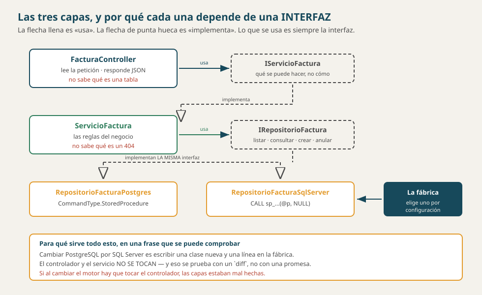

# Arquitectura — Facturación (`bdfacturas`)

> **Qué es este documento.** Cómo está partido el sistema, qué hace cada parte y
> **qué tiene prohibido hacer**. Las prohibiciones son la mitad del documento:
> una arquitectura se define tanto por lo que permite como por lo que impide.
>
> **Los conceptos detrás:**
> [`SOLID_CAPAS_PATRONES.md`](../conceptos/SOLID_CAPAS_PATRONES.md) y
> [`FLUJO_DE_UNA_PETICION.md`](../conceptos/FLUJO_DE_UNA_PETICION.md).
>
> **Material académico simulado**, pero el reparto es real y se puede comprobar
> abriendo las carpetas.
>
> Versión 1.0 · 4 de octubre de 2026.



---

## 1. Tres procesos

| Proceso | Qué es | Puerto |
|---|---|---|
| **`front-blazor`** | Blazor Server. El único que le habla a la persona | 8051 |
| **`api-facturas`** | ASP.NET Core. El único que habla con la base de datos | 8045 |
| **`postgres`** | El motor, con **las reglas del negocio adentro** | 15445 |

En la v5 se le suma **`sqlserver`** (11445), y el interruptor `MOTOR_BD` decide
cuál de los dos atiende.

> **La base de datos NO es un tercero ajeno: es parte del sistema, y de las tres la que
> más código propio tiene.** De las **607 líneas de código** de
> `db/bdfacturas_sqlserver.sql` —sin contar comentarios—, **520 se escribieron en este
> proyecto**: los 3 disparadores y los 16 procedimientos. Las 12 tablas que
> vinieron del curso de Bases de Datos son **87**.
>
> **El conteo es de código a propósito.** El archivo entero tiene más de dos
> mil líneas porque está comentado; contar comentarios haría que la cifra
> cambiara cada vez que alguien explica mejor algo, y entonces no mediría
> nada.
>
> Y no es un dato de contabilidad: **las tablas no deciden nada.** Que el stock
> no quede negativo, que el total cuadre con sus renglones y que una factura no
> se anule dos veces vive **ahí**, no en C#. Ver
> [`FUENTES.md`](FUENTES.md) §0.

> **La regla que no se negocia: en el front no puede haber un solo
> `SqlConnection`.** Si el front puede llegar a la base de datos, la separación es un
> dibujo y no una arquitectura.
>
> **Y se comprueba, no se promete:** apague la API con la base de datos encendida y abra
> el front. Tiene que seguir en pie, con su menú y un aviso de que el servicio
> no está disponible, **y sin una sola fila**. Si sigue mostrando datos, alguien
> abrió una conexión que no debía.

---

## 2. ¿Esto es un monolito?

**Es la pregunta que más se responde mal, y casi siempre por el mismo motivo:
porque todo está en un repositorio.**

> **Un repositorio no es una unidad de despliegue.** El repositorio dice **cómo
> se guarda** el código; la arquitectura dice **cómo se ejecuta**. Son dos cosas
> distintas, y tener todo junto en GitHub se llama **monorepo** — no monolito.

### Las tres palabras, separadas

| | Qué significa | ¿Aplica aquí? |
|---|---|---|
| **Monolito** | **UNA** sola unidad desplegable: todo se compila, se despliega y se cae junto | **Sí** a la API · **Sí** al front · **No** al sistema |
| **Monorepo** | **UN** solo repositorio, con varias unidades adentro | **Sí** |
| **Microservicios** | Muchos servicios pequeños, cada uno con **su propia base**, descubrimiento y despliegue independiente | **No** |

### La respuesta, en una línea

> **La API es un monolito. El front TAMBIÉN. El sistema no.**
>
> Las tres cosas son ciertas **a la vez**, y confundir el nivel es de donde sale
> el error. «Monolito» se predica de **una unidad desplegable** — no de un
> repositorio, no de un sistema entero.

**Por qué la API es un monolito:** es **una** unidad. Sus tres capas y sus
quince controladores viven en el mismo proceso, se compilan juntos y se
despliegan juntos. Si hay que cambiar una línea de `ProductoController`, se
vuelve a desplegar **toda** la API.

**Por qué el front también:** exactamente lo mismo. Sus **15 pantallas** son un
solo proyecto, un solo contenedor y un solo despliegue. Cambiar un color obliga a
volver a publicarlo entero.

**Y por qué el sistema no lo es:** porque son **DOS monolitos**, no uno. Se
compilan por separado, se despliegan por separado, **se caen por separado** —
apague la API y el front sigue en pie— y se hablan **solo por HTTP**.

> **Y aquí está lo que de verdad hay que llevarse: «monolito» no es un insulto.**
> Casi todo software empieza siendo uno, y para este tamaño es **la decisión
> correcta**. Lo que importa no es si algo es monolito, sino **cuántas unidades
> desplegables hay y cómo se hablan**.
>
> Un monolito bien ordenado por dentro —en capas, con interfaces— se llama
> **monolito modular**, y es lo que son estos dos. Partirlos en servicios
> pequeños antes de necesitarlo solo agrega problemas de red a un sistema que
> todavía no los tenía.

**Y por qué no son microservicios:** dos monolitos no son microservicios. Faltan
todas las señas: no hay una base por servicio —hay **una** base compartida—, no
hay descubrimiento, no hay colas, y no hay despliegue independiente de partes de
la API ni del front.

### El nombre que sí le queda

**Arquitectura de tres niveles** *(three-tier)*:

| Nivel | Proceso | Qué decide |
|---|---|---|
| **Presentación** | `front-blazor` | **nada**: pregunta y obedece |
| **Aplicación** | `api-facturas` | la forma de la petición y el flujo |
| **Datos** | `postgres` / `sqlserver` | **el stock, el total, la anulación** |

> **Y aquí hay una diferencia con el three-tier de manual que vale la pena
> notar:** en el libro, el nivel de datos **guarda y ya**. En este sistema
> **defiende las reglas** — por eso la pregunta *«¿dónde va esta validación?»*
> tiene **tres** respuestas posibles y no dos. Ver §4.

### Cómo se comprueba, que es lo que lo vuelve un hecho

```powershell
# 1 · DOS unidades desplegables propias (y un proyecto de pruebas).
Get-ChildItem -Recurse -Filter *.csproj | Where-Object { $_.FullName -notmatch 'obj' }

# 2 · Se despliegan por separado: apague UNA y la otra sigue.
docker compose stop api-facturas
Start-Process http://localhost:8051/facturas
#    El front sigue en pie, con su menú y sin una sola fila.
#    En un monolito eso no se puede: se cae todo junto.

# 3 · Se hablan SOLO por HTTP. Esto tiene que dar 0.
Select-String -Path front_blazor\**\*.cs,front_blazor\**\*.razor `
  -Pattern 'SqlConnection|Npgsql' | Measure-Object | Select-Object Count
```

> **El paso 2 es la prueba.** Si apagar la API tumbara también el front, serían
> una sola unidad — y entonces sí sería un monolito, por más carpetas separadas
> que tuviera.

---

## 3. Las tres capas de la API

| Capa | Qué hace | Qué tiene PROHIBIDO |
|---|---|---|
| **Controlador** | Lee la petición, valida la **forma**, traduce excepciones a códigos HTTP | Escribir SQL · tomar decisiones de negocio |
| **Servicio** | Las reglas: qué se puede y qué no | Saber qué es un 404 · saber qué motor hay debajo |
| **Repositorio** | El SQL y la llamada a los procedimientos | Decidir nada |

Y entre cada par, **una interfaz**:

```
FacturaController  →  IServicioFactura   →  IRepositorioFactura
                          ↑                        ↑
                   ServicioFactura        RepositorioFacturaPostgres
                                          RepositorioFacturaSqlServer
```

> **Lo que se usa es siempre la interfaz, nunca la clase.** Por eso el servicio
> no sabe si detrás hay PostgreSQL, SQL Server o un falso en memoria — y por eso
> se puede probar sin levantar una base.

### El inventario, por recurso

Nueve recursos con sus tres capas, más los dos puentes y las vistas agregadas.
Se puede contar:

| Carpeta | Cuántos | |
|---|---|---|
| `Controllers/` | **15** | uno por recurso, más consultas, permisos y sesión |
| `Servicios/` | **14** + sus 14 interfaces | |
| `Repositorios/` | **28** implementaciones + 14 interfaces | **dos por recurso**: Postgres y SqlServer |

Esos 28 contra 14 son la arquitectura en un número: cada contrato tiene dos
implementaciones, y arriba nadie sabe cuál está puesta.

---

## 4. La fábrica, que es donde se decide el motor

```
Program.cs  →  IFabricaRepositorios  →  FabricaPostgres
                                     →  FabricaSqlServer
```

Un interruptor —la variable `MOTOR_BD`— elige cuál. **Y es el único sitio del
sistema que decide CUÁL IMPLEMENTACIÓN DE REPOSITORIO se usa.**

> **No confundirlo con «no se nombran clases concretas».** `ProductoController` y
> `ServicioProducto` lo son, y se nombran sin problema: de cada uno hay **uno
> solo**. La regla aplica donde hay **dos alternativas** — los repositorios — y
> por eso son los únicos que pasan por la fábrica.

> **Ésa es la prueba del principio abierto/cerrado, y está MEDIDA con un
> `diff`:** agregar SQL Server fueron **12 archivos y 1 232 líneas**, y los
> doce son repositorios nuevos. Sobre `Controllers/` y `Servicios/` el `diff`
> sale **vacío**.
>
> ```powershell
> # los tags de este repositorio son del mapa VIEJO, donde el motor nuevo
> # era la v4: el salto que agregó SQL Server es v3..v4
> git diff --stat v3..v4 -- api_facturas/Controllers api_facturas/Servicios
> git diff --numstat v3..v4 | Select-String SqlServer
> ```
>
> El primero no imprime **nada** —ni una línea cambiada en esas dos capas— y
> el segundo lista los doce archivos con sus líneas. **Si hubiera que tocar
> los controladores o los servicios, las capas estaban mal hechas.**
>
> **Y ojo con el nombre de la versión:** hoy ese trabajo es la **v5** del mapa
> nuevo. No hay tag `v5` todavía, así que el `diff` se pide contra `v3..v4` —
> está explicado en [`CRONOGRAMA.md`](CRONOGRAMA.md).

---

## 5. Dónde vive cada regla, y por qué ahí

| Regla | Dónde | Por qué no más arriba |
|---|---|---|
| El stock no queda negativo | **disparador** | Porque también vale para quien entre por SSMS |
| El total es la suma de subtotales | **disparador** | Igual, y además así no puede desactualizarse |
| Una factura tiene al menos un renglón | **procedimiento** | Va en la misma transacción que la inserta |
| Una factura no se anula dos veces | **procedimiento** | Es una condición sobre el estado, y el estado está en la base de datos |
| El `{}` del PATCH no actualiza nada | **servicio** | Es una decisión de negocio, no de la base de datos |
| Falta el campo `nombre` | **la petición** (anotaciones) | Es forma, y la forma se rechaza antes de entrar |
| ¿Tiene permiso? | **`[ExigePermiso]`**, antes del controlador | Para que ningún método pueda olvidarse de preguntarlo |

> **El criterio es simple:** cuanto más abajo vive una regla, a más gente
> protege. Una validación que solo está en C# protege a quien pasa por la API.

---

## 6. El front: por qué Blazor Server y qué implica

| | |
|---|---|
| **Qué es** | El componente vive **en el servidor**; el navegador recibe HTML y mantiene un **circuito** abierto |
| **Qué gana** | No hay que escribir JavaScript para la interacción, y el estado de la pantalla vive en C# |
| **Qué cuesta** | Si el circuito se corta —se recarga la página, se pierde la red— **la pantalla pierde su estado** |

> **Eso último se nota al emitir una factura:** los renglones que se van
> agregando viven **en el circuito**, no en la base de datos. Oprimir F5 a mitad **los
> pierde**.
>
> **No es un defecto: es la consecuencia de haber escogido Blazor Server.** Si
> hiciera falta que el borrador sobreviviera, habría que guardarlo en otra parte
> —la sesión, el navegador o la base de datos—, y eso es trabajo que esta versión no
> hizo. Está declarado, sin construir, en
> [`3_HISTORIAS_PROPUESTAS.md`](elicitacion/3_HISTORIAS_PROPUESTAS.md).

---

## 7. Lo que NO tiene esta arquitectura

Decirlo evita que alguien lo busque:

| No hay | Y en su lugar |
|---|---|
| Entity Framework ni ningún ORM | SQL escrito a mano y **Dapper** como micro-ejecutor |
| Caché | Cada petición va a la base de datos |
| Colas, eventos, mensajería | Todo es síncrono dentro de la petición |
| Microservicios | Tres procesos, y ya — ver §2 |
| Repositorio genérico `Repositorio<T>` | Uno por recurso, a propósito — ver abajo |

> **Por qué no un `Repositorio<T>` genérico ni un `/api/{tabla}`.** Porque el
> contrato quedaría en blanco: Swagger no diría qué recursos hay, los permisos
> no se podrían dar por recurso, y cada cambio tocaría las doce tablas. Es el
> Artículo 10 de la constitución, y la razón está escrita ahí.

---

## 8. Comprobarlo

| Qué se afirma | Cómo se comprueba |
|---|---|
| El front no toca la base de datos | Apague `api-facturas` y abra el front: en pie y sin filas |
| Las capas no se saltan | En `Controllers/` no hay ni un `SqlConnection` —**0 archivos**—, y en `Repositorios/` no hay ni un `StatusCode` —**0**—. La palabra `Sql` sí aparece dos veces en los controladores, pero **en comentarios**, explicando que `SqlException` se traduce a 500 |
| Cambiar de motor no toca arriba | `git diff --stat v4..v5 -- api_facturas/Controllers api_facturas/Servicios`: **vacío** |
| Las reglas están abajo | Intente dejar el stock negativo con un `INSERT` directo en SSMS |
